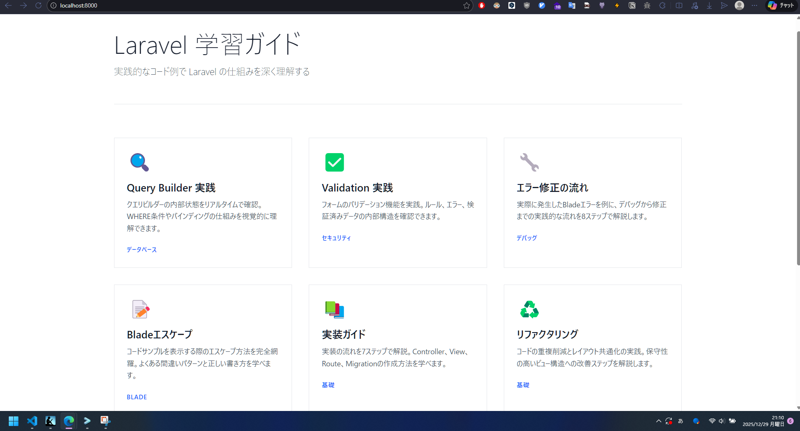
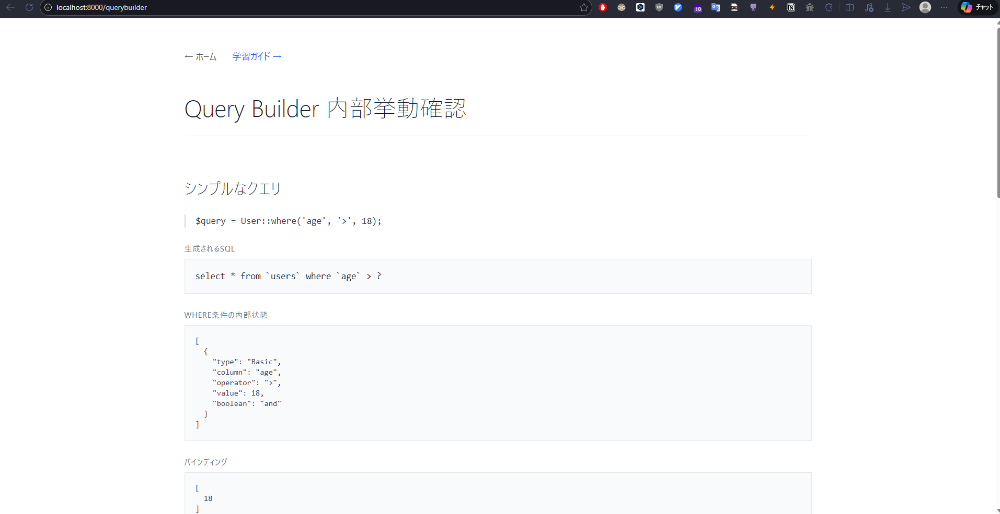

# デザインバリエーション

Tailwind CSS を使った各デザインパターンの特徴と実装メモ。

---

## design/minimalist - ミニマリストデザイン

**コンセプト:** シンプル・イズ・ベスト

### 特徴

#### 配色

-   ベース: 白 (`bg-white`)
-   テキスト: グレースケール (`text-gray-900`, `text-gray-600`)
-   アクセント: 控えめな青 (`text-blue-600`, `hover:border-blue-500`)
-   ボーダー: 薄いグレー (`border-gray-200`)

#### レイアウト

-   余白を活かした呼吸感のあるデザイン
-   細いボーダーライン（1px）
-   シンプルなグリッド（カード間の余白: `gap-8`）

#### タイポグラフィ

-   `font-light` - 軽やかで洗練された印象
-   大きめの見出し (`text-5xl`, `text-4xl`)
-   小文字の uppercase ラベル (`text-xs uppercase tracking-wider`)

#### ホバーエフェクト

-   カード: ボーダーカラーのみ変化 (`hover:border-blue-500`)
-   リンク: テキストカラー変化 (`hover:text-gray-900`)
-   トランジション: `transition-colors duration-300`

### Welcome ページ

```tsx
// 主な特徴
- border-b でセクション区切り
- カードは border のみ（影なし）
- ホバーで青いボーダーに変化
```



### QueryBuilder ページ

```tsx
// 主な特徴
- 左ボーダー（border-l-2）でコード引用を表現
- bg-gray-50 のコードブロック
- definition list (dl/dt/dd) でポイント整理
```



### 向いているケース

-   プロフェッショナルなドキュメント
-   読みやすさ重視
-   テキストコンテンツが多いサイト
-   落ち着いた印象を与えたい場合

---

## その他のデザイン（作成予定）

-   design/dark-mode - ダークテーマ
-   design/glassmorphism - ガラスモーフィズム
-   design/brutalist - ブルータリズム
-   design/soft-pastel - ソフトパステル
-   design/modern-colorful - カラフル・モダン（既存）
